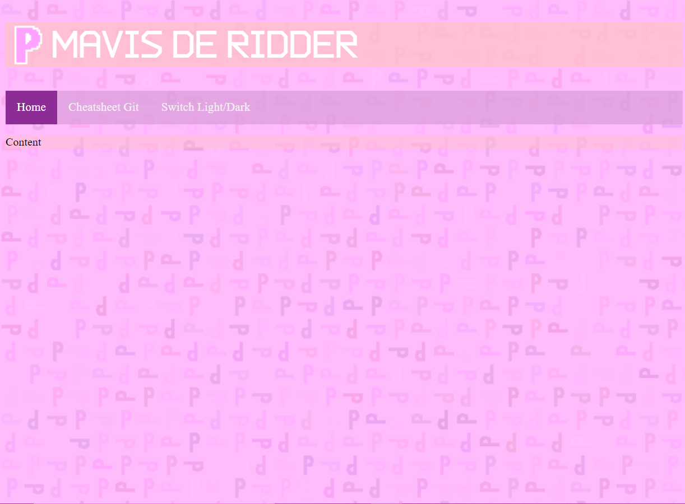
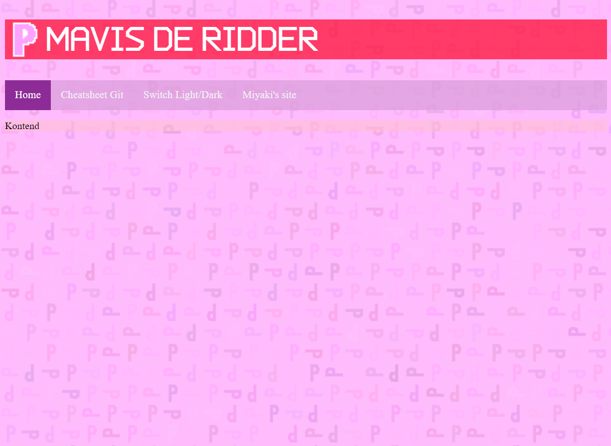

# Les 12 opdrachten

## Opdracht 1

**Before:**

**After:**

* Kleur aangepast via de css editor in de debugger;
* Tekst aangepast via de html editor;
* Extra menuknop toegevoegd via de html editor (kopiëren en plakken van andere knop, tekst en link veranderen).
